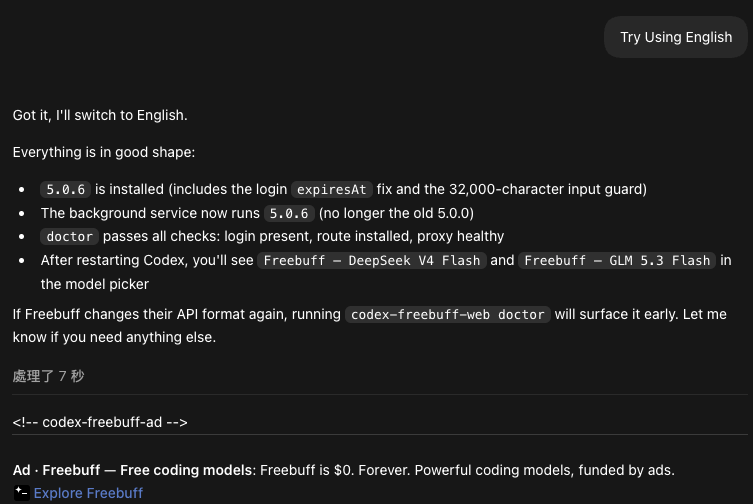

<h1 align="center">Freebuff for Codex</h1>

<p align="center">
  <strong>Codex のネイティブモデル選択画面から Freebuff 公式の無料コーディングセッションを使用。</strong><br>
  ChatGPT Web、ブラウザ自動化、MCP tunnel、API Key は一切使用しません。
</p>

<p align="center">
  <a href="README.md">English</a> · <a href="README.zh-CN.md">简体中文</a> · <a href="README.ja.md">日本語</a>
</p>

<p align="center">
  <a href="https://freebuff.com/cli">Freebuff CLI</a> ·
  <a href="https://freebuff.com/chat">Freebuff Web Chat</a> ·
  <a href="https://github.com/CodebuffAI/codebuff">公式ソース</a> ·
  <a href="SECURITY.md">セキュリティ</a>
</p>

```text
Codex task ──Responses + SSE──▶ codex-freebuff-web
                                    │
                                    ├─ 公式 Freebuff セッション承認
                                    └─ @codebuff/sdk ──▶ Freebuff バックエンド

codex-freebuff-web freebuff ──▶ 公式インタラクティブ Freebuff CLI
codex-freebuff-web open chat ──▶ https://freebuff.com/chat
```

この bridge は Codex のネイティブな Responses/task インターフェースを維持したまま、
`freebuff/base` と `freebuff/glm-5.3-flash` を公式 Freebuff の無料コーディングセッションに
マッピングします。ログインは公式のブラウザデバイスフローを使い、手動で一度だけサインインします。
API Key の作成や貼り付けは不要で、公式 Freebuff CLI のインストールも必須ではありません。

<p align="center">
  
</p>

## クイックスタート

> AI による自動インストール：プロジェクトディレクトリで
> `curl -fsSL https://raw.githubusercontent.com/Jakevin/codex-freebuff-web/main/scripts/install.sh | sh -s -- --full --cwd "$PWD" && "$HOME/.local/bin/codex-freebuff-web" login`
> を実行すると、インストール後にブラウザが開き、一度だけ Freebuff にログインできます。

一般ユーザーに必要なのは macOS、ネットワーク、ブラウザのみです。配布版には Bun 1.4.0 runtime が
同梱されているため、Bun も公式 Freebuff CLI も別途インストールする必要はありません。

```bash
# 1. Bun 同梱の bridge 配布版をインストール
curl -fsSL https://raw.githubusercontent.com/Jakevin/codex-freebuff-web/main/scripts/install.sh | sh

# 2. Freebuff に変更させたいプロジェクトディレクトリで setup を実行
$HOME/.local/bin/codex-freebuff-web setup --full --cwd "$PWD"

# 3. ブラウザで一度だけサインイン（freebuff CLI は不要）
$HOME/.local/bin/codex-freebuff-web login
```

setup をインストールコマンドにまとめたい場合は、プロジェクトディレクトリで実行します：

```bash
curl -fsSL https://raw.githubusercontent.com/Jakevin/codex-freebuff-web/main/scripts/install.sh | sh -s -- --full --cwd "$PWD"
$HOME/.local/bin/codex-freebuff-web login
```

`codex-freebuff-web login` はログイン URL を表示し、macOS ではブラウザを開きます。そこで
GitHub/Google のサインインを完了してください。bridge は公式互換のログインセッションを
`~/.config/manicode/credentials.json` に書き込むだけで、認証情報の自動入力は行わず、token を
自身の config に保存することもありません。SSH 環境やブラウザを開きたくない場合は
`codex-freebuff-web login --no-open` を使用してください。

macOS の setup はバックグラウンドサービスをインストールしようとします。他のプラットフォームでは
bridge を手動で起動したままにしてください：

```bash
bun run src/cli.ts serve
```

Codex を再起動すると、モデル選択画面に `Freebuff — DeepSeek V4 Flash` と
`Freebuff — GLM 5.3 Flash` が表示されます。ローカルの `freebuff/base` と
`freebuff/glm-5.3-flash` は bridge の Codex ルートで、それぞれ公式 Freebuff モデル
`deepseek/deepseek-v4-flash` と `z-ai/glm-5.3-flash` を使用します。

bridge は毎ターンの最新 user/agent message に、Freebuff Web の入力境界に基づく 32,000 文字の
安全リミットを適用します。超過時はメッセージを短くして再試行するよう求めるエラーを返し、静かに
切り詰めることはしません。公式 CLI の公開ソースには現時点で固定のプロンプト文字数上限はなく、
トークンのコンテキストウィンドウとコンテキストの刈り込みに依存しています。

## Codex 内の Freebuff 広告

成功した Freebuff の返答のたびに、`Ad · Freebuff` と明示されたテキスト広告が表示されます。
bridge は公式 CLI と同じ `/api/v1/ads` エンドポイントを優先し、広告サービスの在庫がない場合や
接続できない場合は公式 Freebuff の house ad を表示します。広告は独立した Responses 出力であり、
モデルのプロンプトには入らず、返答のトークン使用量にも含まれません。広告の決定には現在のユーザー
メッセージだけが送られ、system prompt、リポジトリ履歴、ツール結果、アシスタントの返答は送信され
ません。インプレッションは広告表示後にベストエフォートで報告され、失敗してもコーディングタスクに
影響しません。

読み取り専用モード：

```bash
bun run src/cli.ts setup --read-only --cwd "$PWD"
```

## Web Chat

Freebuff Web Chat は、調査や一般的な会話のための独立したブラウザ製品の入り口です。この bridge の
ワークスペースコーディングトランスポートではありません。開くには：

```bash
codex-freebuff-web open chat
# または
codex-freebuff-web webchat
```

Web Chat ページでは手動でサインインしてください。Web Chat のブラウザ cookie は自動的には bridge の
credentials になりません。Codex bridge でローカルのコーディングタスクを実行する前に
`codex-freebuff-web login` を実行してください。

## 公式 CLI の使用

公式 `freebuff` npm パッケージは対話式のターミナル TUI で、Responses/SSE に安全にパースできる
one-shot stdout プロトコルは提供しません。そのため公式 CLI は任意の対話入り口としてのみ残されて
います。Codex の各タスクは公式 `@codebuff/sdk` を使用し、同じ公式互換のログインセッションを読み、
公式 Freebuff のセッション承認と `costMode=free` を使います。

```bash
# 公式 CLI を直接起動（任意。bridge には不要）
freebuff

# または bridge 経由で公式 CLI の引数をすべて転送
codex-freebuff-web freebuff

# 公式 CLI のドキュメントを開く
codex-freebuff-web open cli
```

## セットアップと診断

```bash
codex-freebuff-web doctor
codex-freebuff-web service status
codex-freebuff-web route status
codex-freebuff-web open cli
codex-freebuff-web open chat
codex-freebuff-web uninstall --yes
```

bridge はデフォルトで `127.0.0.1:17841` をリッスンし、Responses エンドポイントは `/v1` です。
setup では `--port`、`--cwd`、`--agent`、`--max-agent-steps` を指定できます。

credentials がデフォルト以外の場所にある場合は、setup 時に指定します：

```bash
codex-freebuff-web setup --credentials-path "/absolute/path/credentials.json" --cwd "$PWD"
```

`CODEBUFF_API_KEY` と `--api-key` は旧セットアップ用の互換フォールバックとしてのみ残されています。
通常の Freebuff 無料フローに API Key は不要です。

## 開発

Bun が必要になるのは、ソースから開発する場合か、自分で配布版をビルドする場合だけです：

```bash
bun run typecheck
bun test tests/freebuff.test.ts
bun run build
```

プロジェクトは [Jakevin/codex-freebuff-web](https://github.com/Jakevin/codex-freebuff-web) に
あります。Freebuff のソースは [CodebuffAI/codebuff](https://github.com/CodebuffAI/codebuff) に
あります。

## License

上流プロジェクトは MIT です。Codebuff SDK は Apache-2.0 です。[LICENSES](LICENSES) のサードパーティ
通知を参照してください。